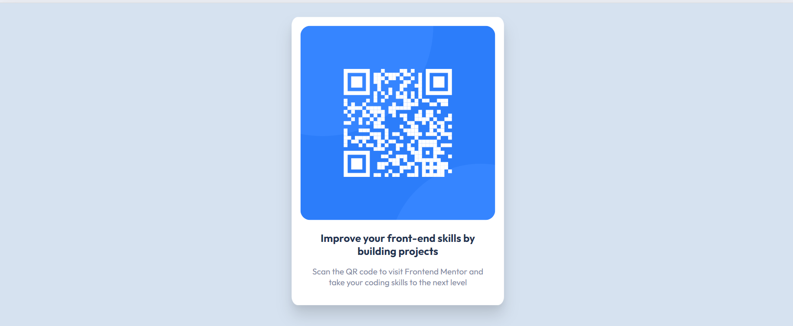

# Frontend Mentor - QR code component solution

This is a solution to the [QR code component challenge on Frontend Mentor](https://www.frontendmentor.io/challenges/qr-code-component-iux_sIO_H). Frontend Mentor challenges help you improve your coding skills by building realistic projects. 

## Table of contents

- [Overview](#overview)
  - [Screenshot](#screenshot)
  - [Links](#links)
- [Built with](#built-with)

**Note: Delete this note and update the table of contents based on what sections you keep.**

## Overview
Very quick excercise with responsive design. Because I haven't done it in a while. 

### Screenshot

### Links
- Live Site URL: [Live site on Netfily](https://beautiful-mooncake-bca85a.netlify.app/)

## Built with

- HTML5 markup
- CSS
- CSS Media Queries
